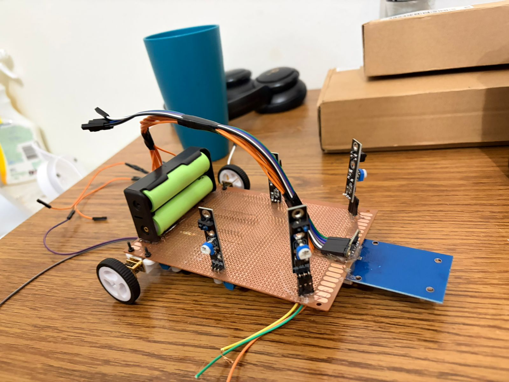
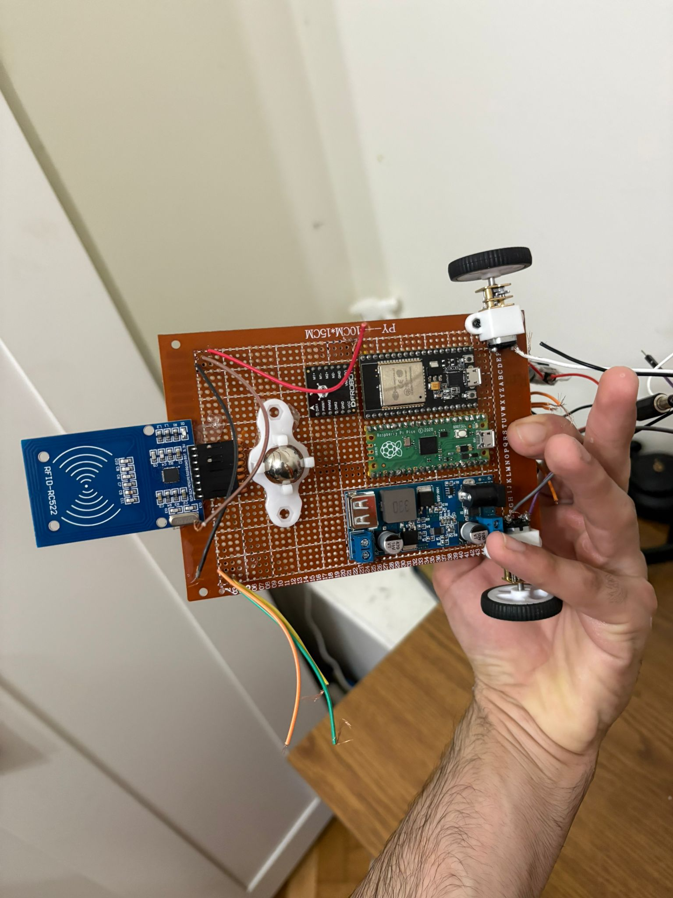
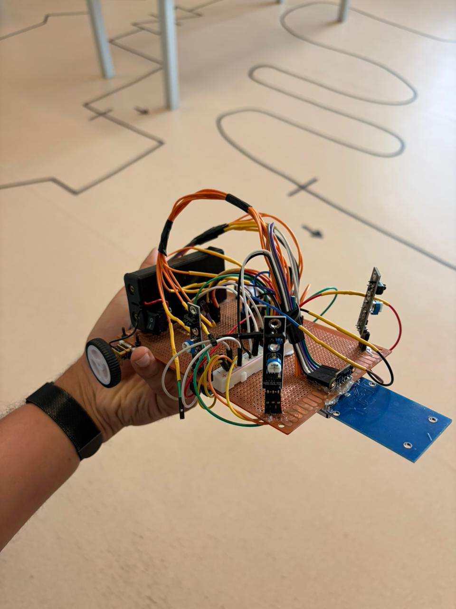

# Prototype V1

## Overview

Prototype V1 was the first fully assembled version of the KEMET robot. It established the core hardware architecture: ESP32 for sensing and navigation, Raspberry Pi Pico for motor control, TB6612FNG motor driver, and breadboard-based wiring.

## Main Components

- Raspberry Pi Pico (motor controller)
- ESP32 (navigation, sensing)
- TB6612FNG motor driver
- 2× DC gear motors (Ø 37 mm wheels)
- 2× HC-89 optical encoders
- 2S Li-ion battery pack
- Buck converter (5 V regulated)
- Breadboard wiring

## Status

Prototype V1 hardware is assembled. Phase 1 firmware (encoder-based motor calibration) is in progress.

## Known Issues

- Wiring is all-breadboard: jumper wires may move during turns and cause intermittent faults.
- No decoupling capacitors installed on Sharp IR sensors yet.
- TB6612 STBY is permanently tied HIGH; no software enable/disable.
- Robot dimensions not yet measured against competition limit (280 × 280 × 150 mm).

## Photos

*Top view of Prototype V1 showing initial chassis assembly and component placement.*

*Side view of Prototype V1 showing motor and wheel layout.*

*Top view after wiring integration: ESP32, Pico, breadboard, HC-89 encoders, battery, and power module visible.*

*Side/rear view after wiring integration showing power system routing.*
