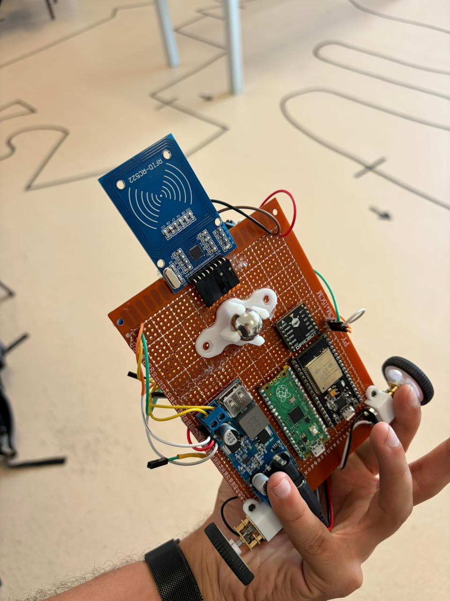

# KEMET — Autonomous Maze-Solving Robot

> Embedded C++ · ESP32 + Raspberry Pi Pico · RFID navigation · Encoder-based motor control

Built for the **Óbuda University Labyrinth Competition**. KEMET navigates a maze fully autonomously — no remote control, no external compute. It reads RFID tags at intersections, drives between walls using IR and ToF sensors, and executes turns with encoder-closed-loop feedback.

---

## Demo

> Video coming after first successful maze run.
> 
> Phase 1 preview: encoder-based straight driving + 90° pivot calibration sequence (Straight → Right → Right → Left → Left, repeating).

---

## What It Does

| Capability | Implementation |
|-----------|----------------|
| Navigate maze intersections | RC522 RFID reader decodes `LEFT` / `RIGHT` / `DEAD END` tags |
| Drive straight without drift | Encoder pulse comparison between left and right wheel; software trim |
| Execute accurate 90° turns | Encoder-counted pivot; separate left/right calibration constants |
| Detect walls | VL53L1X ToF (front) + 4× Sharp IR (sides) |
| Stop before hitting walls | Front ToF threshold at 150 mm |
| Distributed control | ESP32 handles sensing + logic; Pico handles motors over UART |

---

## Architecture

```
┌─────────────────────────────────┐     UART 115200     ┌──────────────────────┐
│            ESP32                │ ─── "FWD\n" ──────► │   Raspberry Pi Pico  │
│  • RFID (RC522, SPI)            │ ◄── "OK\n" ──────── │  • PWM motor drive   │
│  • ToF wall sensor (VL53L1X)    │                      │  • Encoder counting  │
│  • 4× Sharp IR (analog ADC)     │                      │  • 90° pivot control │
│  • Maze graph + path logic      │                      │  • Drift correction  │
└─────────────────────────────────┘                      └──────────────────────┘
         │                                                        │
         └───────────── TB6612FNG motor driver ◄──────────────────┘
                              │
                    Left motor · Right motor
                   (HC-89 encoders, 35 PPR)
```

**Power:** 2S Li-ion → main switch → buck converter (5 V logic) + direct to motor rail (7.2–8.4 V)

---

## Hardware

| Component | Part |
|-----------|------|
| Navigation controller | ESP32 (ESP-WROOM-32) |
| Motor controller | Raspberry Pi Pico |
| Motor driver | TB6612FNG |
| Motors | 2× DC gear motors, Ø 37 mm wheels |
| Wheel encoders | 2× HC-89 optical (35 pulses/rev, measured) |
| RFID reader | RC522 — **3.3 V only** |
| Front distance | VL53L1X Time-of-Flight |
| Side distance | 4× Sharp GP2Y0A51SK0F analog IR |
| Power | 2S Li-ion + step-down buck converter |

**Competition constraint:** robot must fit inside `280 × 280 × 150 mm`, operate with no external communication.

---

## Repository Structure

```
KEMET/
├── Code/
│   ├── Pico/motor_control/          ← Phase 1: encoder-based motor calibration (.ino)
│   └── ESP32-mapper/INCLUDE/        ← Maze graph types, sensor manager, pin config (.h)
├── Hardware/
│   ├── wiring_diagrams/             ← Full pin-to-pin tables for V1 and V2
│   ├── schematics/                  ← EasyEDA schematic JSON + generator script
│   └── bill_of_materials.md
├── Docs/
│   ├── system_architecture.md
│   ├── motor_control.md
│   ├── rfid_navigation.md
│   ├── calibration.md
│   ├── wall_following.md
│   ├── troubleshooting.md
│   └── prototypes/prototype_v1.md · prototype_v2.md
├── Tests/
│   ├── turn_tests/
│   ├── straight_line_tests/
│   └── ...
└── Media/photos/
```

---

## How to Run (Phase 1 — Motor Calibration)

**Hardware required:** Raspberry Pi Pico + TB6612FNG + 2 motors + 2 HC-89 encoders. No ESP32 needed for Phase 1.

```bash
# 1. Open Arduino IDE
# 2. Board: Raspberry Pi Pico (arduino-pico core)
# 3. Flash:
Code/Pico/motor_control/phase1_motor_calibration.ino

# 4. Open Serial Monitor at 115200 baud
# Robot runs: Straight → Right → Right → Left → Left, then repeats
```

**Key constants to tune** (top of the sketch):

```cpp
static const int BASE_PWM        = 160;  // straight speed
static const int TURN_PWM        = 130;  // turn speed
static const int STRAIGHT_PULSES =  70;  // ~23 cm distance
static const int TURN_90_PULSES  =  28;  // pulses for 90° pivot — tune this
```

See [`Docs/calibration.md`](Docs/calibration.md) for the full procedure.

---

## Development Status

| Phase | Status | Description |
|-------|--------|-------------|
| 1 — Motor calibration | **In progress** | Encoder-based straight + 90° pivot on Pico alone |
| 2 — UART integration | Planned | ESP32 sends movement commands to Pico |
| 3 — Wall detection | Planned | Front ToF stops robot before hitting walls |
| 4 — RFID navigation | Planned | ESP32 reads tags and relays turn commands |
| 5 — Maze mapping | Planned | Graph-based path memory + second-run optimisation |

---

## Documentation

- [System Architecture](Docs/system_architecture.md)
- [Motor Control](Docs/motor_control.md)
- [Calibration](Docs/calibration.md)
- [RFID Navigation](Docs/rfid_navigation.md)
- [Wall Following](Docs/wall_following.md)
- [Hardware Design](Docs/hardware_design.md)
- [Electronics & Power](Docs/electronics_power_system.md)
- [Competition Rules](Docs/competition_rules_summary.md)
- [Testing Protocol](Docs/testing_protocol.md)
- [Troubleshooting](Docs/troubleshooting.md)
- [Prototype V2](Docs/prototypes/prototype_v2.md)

---

## Prototype Photos


*Prototype V2 — ESP32, Pico, RC522, HC-89 encoders, buck converter, and 2S Li-ion battery integrated on chassis.*


*Prototype V1 — full wiring integration stage.*

---

## Team

KEMET Maze Robot Team — Óbuda University
